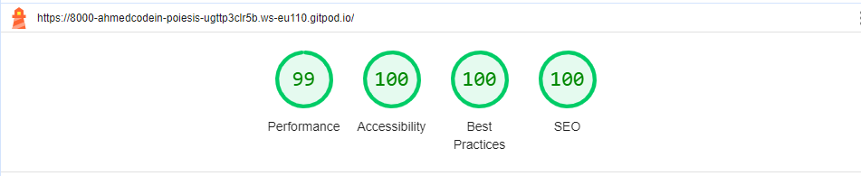
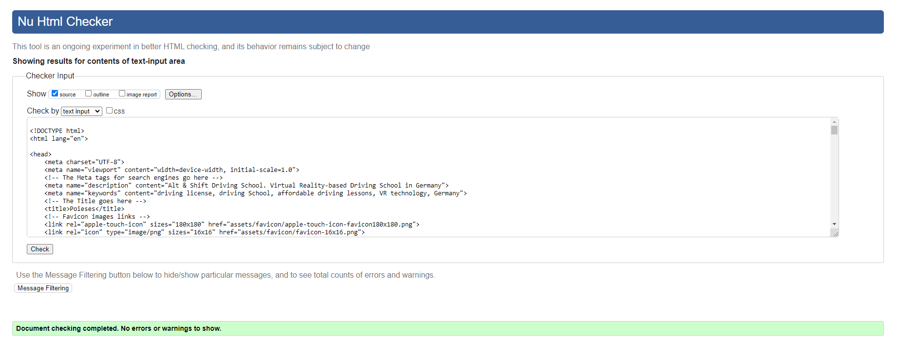

# Poiesis

Poiesis is a start-up company aims to disrupt the traditional driving school business. It wants to do so by combining two technologies into the business process. These are:

1. Virtual Reality
2. Process Automation

Exploiting those technologies will allow Poiesis to Alt and Shift the driving school business forever. 

Poiesis technology allow it to serve its customer with:

1. Cost Saving
2. Fun Experience
3. Flixibility

Poiesis, the customer, has recruited a web developer, the author, to develop a website that supports its business objectives of creating new customer base for its offering. 

The website objectives are laid out in the next section. Thereafter, a description of a typical user need is presented to which the website is supposed to speak to those needs and make them engage with Poiesis.

## Customer Requirement:

The three overarching goals of the website are:

1. Educate the market about Poiesis new approach.
2. Become the main channel to reach out to and intract with the custmer
3. Act as the first sales channel of the company.

Toward achieving those overarching objectives, Poiesis's website requirement are presented as follows:

1. A futuristic feeling should be observed.
2. Engaging the visitor directly with a problem statement that speaks to the real pain of the potential customer.
3. A true solution is laid out explaining why the visitor should consider Poiesis.
4. A clear price presentation as to how much the customer will pay if chose to move to the next step in engaging with the company.
5. An easy way in presenting the offers, signaling the customer a smooth and fast backend processes and approach
6. A page where the visitor can reach out to the company to learn more about the offers, technology, process etc. in case the visitor is still hesitant to commit to any of the offered plans.

## The Website Visitor expectations

As per Poiesis marketing and sales team, the following aspects have been collected as to what the website visitor would expect and want to see in the Poiesis website.

1. a Website that speaks to driving license seekers by focusing on the following aspects, presented without order:

1. How can this school be different from other driving schools?
2. How can I acquire the license with less money and time?
3. How can I enjoy the learning process yet still achieve my three main objectives, the driving license with less money and shorter duration.

------

## Features

------

## Testing

The author has performed multiple tests during each stage of the development. In this document, however, the author presents only the most recent ones and goes swiftly over few issues from earlier tests that stand out.

1. To adhere to the user experience best practice, the author decides to include a home link to the logo in the header. By doing so, however, the Wave evaluator showed an error of: adjacent links pointing to the same destination is not acceptable. Hence, the author reverts to the original arrangement, that is of not including such functionality to the logo. 

2. An error observed by Lighthouse tool, the error states that some font sizes in the plans page is small to be accepted. Hence, and as a result the author increased the fonts to the acceptable size. Such action led to changes in multiple selectors properties.

3. The author faced a problem with Wave tool regarding the nav label that appears empty. Before that, the author has implemented a given set of steps to hide the label content without showing any accessibility errors. The solution functions very well, excepte that one of the properties, which is path, appeared to be deprecated. 

4. The author could not find a solution to the aforementioned error. Therefore, the author improvised and removed the property, and to his surprise, the solution is still functioning. The author has no explanation as to why this is the case.

5. CSS validator shows a warning, see the CSS validator captures below, regarding the imported Google Fonts. To the best knowledge of the author, there is no ready solution for this issue yet. The author can make such claim based on two facts:

a) In the walkthrough project, Love Running, the instructor mentioned that such error is out of developer control. Therefore, she does not consider this as an issue.

b) The author read that some other students have considered this issue before without avail. 

### Test tools and Final Tests captures

Four tools are used to test the websites code, performance are accessibility. These are:

1. W2C Validator for HTML
2. W2C Validator for CSS
3. Wave
4. Lighthouse

Foue tools/environment are used to test responsive and compatibility. These are:

1. Chrome
2. Edge
3. Firefox
4. DevTools

It is worth mentioning here, that while the author is checking the compatibility of the website across different browsers, he noticed some browsers where particularly problematic. They show an error within DevTools. The error is Unchecked runtime.lastError: The message port closed before a response was received.

After some investigations, it appears that some ad-ons prevent any sort of communications between the website and the DevTools. The solution to such an issue is simply to remove those extensions one by one and check whether the error disappears. In our case, the author is happy to report that such a problem is resolved by that very action. The website is functional without issues on the three browsers mentioned above and without responsivity problems.

#### Test Resuts

The list of captures here shows some of the tests before the submission:

##### Lighthouse Results

The lighthouse results show some differences between the mobile and disktop tests. The latter has shown a siginifcantly better results. The author explination is that the size of the images in the case of the mobile, for some reason, degredates the performance of the website. 

###### Mobile Test Results:

Home Page

Plans Page

 

Contact Page

  

######  Disktop Test Results

Home Page

Plans Page

 

Contact Page

  

##### W3C Validator Results

Home Page

Plans Page

 

Contact Page

CSS W3C Test Results

Error:

Page One of the Test

Page Two of the Test

Fix:

Page One of the Test

Page Two of the Test

##### Wave Tests Results

Home Page

Plans Page

  

Contact Page

## Deployment

## Reference and Credits

### References

The following referenceses had a great impact on the author thinking and style for developing the website. The author, to his best, tried to reference them either in the html or the CSS files where appropriate. However, if the author failed to do so in some places, it is only because of the time constrained. The credits and gratitude are given to each of them for the valuable help their contents provided.

1. Code institute Learning Materials
2. Learn Flexbox in 15 Minutes - YouTube channel Web Dev Simplified, [Learn Flexbox in 15 Minutes](https://www.youtube.com/watch?v=fYq5PXgSsbE)

3. How To Make Subscription Page For Website Using HTML And CSS | Price Plan Page design, YouTube channel: GreatStack, [link](https://www.youtube.com/watch?v=rTxeucqOajI)
4. Code Institute Walkthrough projec: Love Running. 
5. Code Article: Inclusively Hidden, a nice walkthrough of the different ways to hide things on the web, [link](https://css-tricks.com/inclusively-hidden/).
6. CI's PP1 student project Dhadda's Detailing, [Dhadda's Detailing](https://rdhadda.github.io/Dhaddas-Detailing/index.html).

7. A Complete Guide to Flexbox, [CSS-Tricks](Link: https://css-tricks.com/snippets/css/a-guide-to-flexbox/)

### Content, Media and Tools

1. The images used in this project is created by OpenAI Chat GPT-4 based on the autthor instructions, [OpenAI Chat GPT-4](https://chat.openai.com/auth/login).

2. The social media icons and the Triple bar icon is downloaded from Font Awesome, [Font Awesome](https://fontawesome.com/).

3. Google fonts is used to define the fonts in the stylesheet, [Google fonts](https://fonts.google.com/).

3. Wordcounter is used to track the number of characters of each git commit, [Wordcounter](https://wordcounter.net/character-count).

## Achnowlegdment

My sincere graduate and appreciation go to my mentor, Mr. David Bowers, for his valuable advice and laser-focused conversations. His inputs, tips and feedback have been no less than master class of coaching and mentorship. I am looking forward to working with him in the future on the next projects within the course of this program. 

My thanks and love go to my wife and daughter for their patience during the period of developing this project. I have not been around them enough during this period, yet they have been with me providing all the support and the help whenever I need. This is what nothing else can substitute in this life, having a loving and a supportive family. Thank you!
